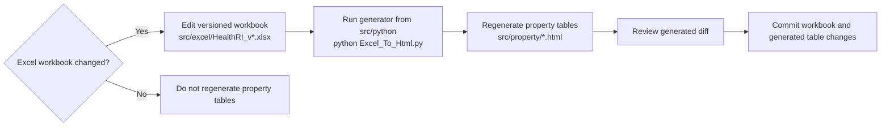
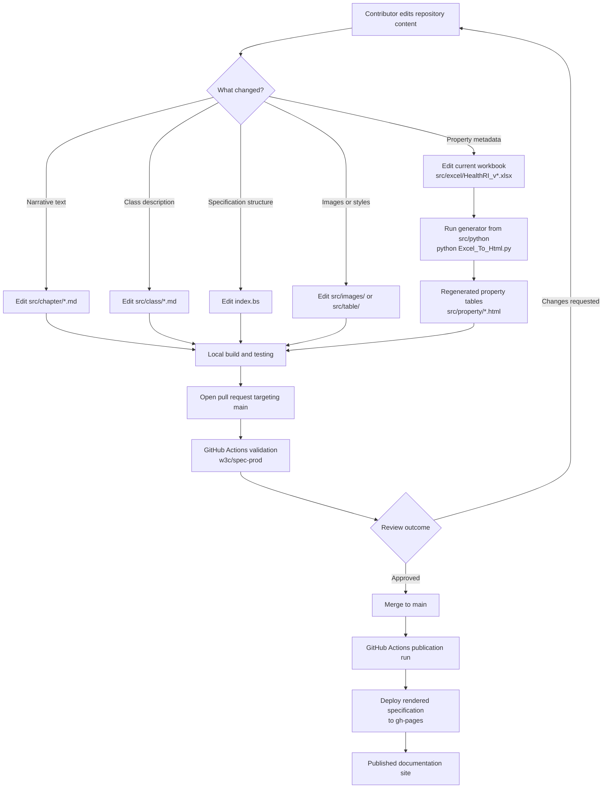

# Health-RI Metadata Documentation

This repository contains the source files, generated documentation fragments, and publication workflow for the **Health-RI Metadata Model documentation**.

The published documentation describes the Health-RI Core Metadata Schema for the **National Health Data Catalogue**.

| Resource                 | Link                                                                                              |
|--------------------------|---------------------------------------------------------------------------------------------------|
| Published specification  | [health-ri.github.io/metadata-documentation](https://health-ri.github.io/metadata-documentation/) |
| Related model repository | [Health-RI/health-ri-metadata](https://github.com/Health-RI/health-ri-metadata)                   |
| Repository issue tracker | [health-ri-metadata issues](https://github.com/Health-RI/health-ri-metadata/issues)              |

---

## Purpose

This repository is used to maintain and publish the human-readable technical specification of the Health-RI Core Metadata Schema.

It contains:

* the main Bikeshed source file  
* manually maintained explanatory chapters  
* manually maintained class descriptions  
* an Excel workbook used as structured source material for generated property tables  
* a JSON configuration file for controlled vocabulary mappings, requirement lookups, and property links  
* a Python script that converts Excel content into HTML table fragments  
* generated property-table fragments included by Bikeshed  
* GitHub Actions configuration for publication to GitHub Pages  

This repository is primarily intended for **internal use** by documentation maintainers, metadata model maintainers, and technical contributors working on the specification website.

It is **not** the main repository for Health-RI metadata model artifacts.  
Model-level artifacts, SHACL shapes, releases, and **all issue tracking (including documentation issues)** are maintained in: https://github.com/Health-RI/health-ri-metadata

---

## Useful resources 

The Health-RI metadata ecosystem uses multiple repositories, tools, and publication targets.

| Resource | Role | Description |
|----------|------|------------|
| https://github.com/Health-RI/metadata-documentation | Documentation repository | Bikeshed source, Markdown chapters, class descriptions, generated property tables, and publication workflow |
| https://github.com/Health-RI/health-ri-metadata | Main metadata repository | Core metadata schema artifacts, SHACL shapes, releases, and all issue tracking (including documentation issues) |
| https://health-ri.github.io/metadata-documentation/ | Published specification | Rendered HTML documentation |
| https://doi.org/10.5281/zenodo.15395604 | DOI record | Citable archival record |
| https://speced.github.io/bikeshed/ | Bikeshed documentation | Documentation for the Bikeshed tool |
| https://www.w3.org/TR/vocab-dcat-3/ | DCAT 3 | W3C Data Catalog Vocabulary |
| https://docs.geostandaarden.nl/dcat/dcat-ap-nl30/ | DCAT-AP NL 3.0 | Dutch DCAT application profile |
| https://healthdataeu.pages.code.europa.eu/healthdcat-ap/ | HealthDCAT-AP | Health domain DCAT profile |

In short (how to use these):

- use this repository to edit, build, and publish the technical specification  
- use the metadata repository for schema artifacts and all issue tracking  
- use the published specification for reading and reference  

---

## Repository structure and source-of-truth

Different parts of the specification are maintained in different locations.

| Content | Location | Generated | Usage / Notes |
|--------|----------|-----------|----------------|
| Specification structure and configuration | `index.bs` | No | Controls document structure and includes other content |
| Narrative chapters | `src/chapter/*.md` | No | Edit for explanatory documentation |
| Class descriptions | `src/class/*.md` | No | Edit for class-level documentation |
| Property definitions (labels, URIs, cardinality, etc.) | `src/excel/HealthRI_v*.xlsx` | Partly | Edit here; regenerate property tables afterwards |
| Property tables | `src/property/*.html` | Yes | Generated from Excel; do not edit manually |
| Table styling | `src/table/*.md` | No | Styling fragments |
| Images and diagrams | `src/images/` | No | Visual assets |
| Generator scripts | `src/python/` | No | Contains Excel-to-HTML generator |
| Publication workflow | `.github/workflows/publish.yml` | No | GitHub Actions build and deploy process |
| Documentation site (deployment) | `gh-pages` branch | Yes | Published documentation output |
| Rendered HTML file | `index.html` | Yes | Generated output; do not edit manually |
| Repository overview | `README.md` | No | Maintainer documentation |

### Maintenance rules

- Edit the upstream source, not generated output  
- Do not manually edit `index.html`  
- Do not manually edit generated `src/property/*.html` unless explicitly justified  
- Treat the Excel workbook as the source of truth for property metadata  
- Regenerate tables only when the Excel workbook changes  
- Publication is handled via GitHub Actions, not manual HTML edits  

---

## Build and publication pipeline

The documentation workflow has two related but distinct parts:

1. Property-table generation (when the Excel workbook changes)  



2. Specification rendering and publication  



---

## Local build and testing

The production publication workflow is automated through GitHub Actions. Local builds are useful to test and preview changes before opening or merging a pull request.

Install Bikeshed:

```bash
pipx install bikeshed
bikeshed update
```

Build locally:

```bash
bikeshed spec index.bs index.html
```

Dry-run (no output):

```bash
bikeshed --dry-run spec index.bs
```

Use this local build process to:

- verify that the specification renders correctly  
- catch errors or warnings early  
- test changes before submitting a pull request  

Do not manually edit the generated `index.html`.

---

## Publication

The documentation is published at:

https://health-ri.github.io/metadata-documentation/

If changes are not visible:

- check the GitHub Actions workflow runs and confirm they completed successfully  
- verify that the changes were merged into the `main` branch  
- check the `gh-pages` branch to confirm the updated content was deployed  
- ensure that generated files (e.g. `index.html`) were included in the commit  
- refresh the page and clear your browser cache if necessary  
