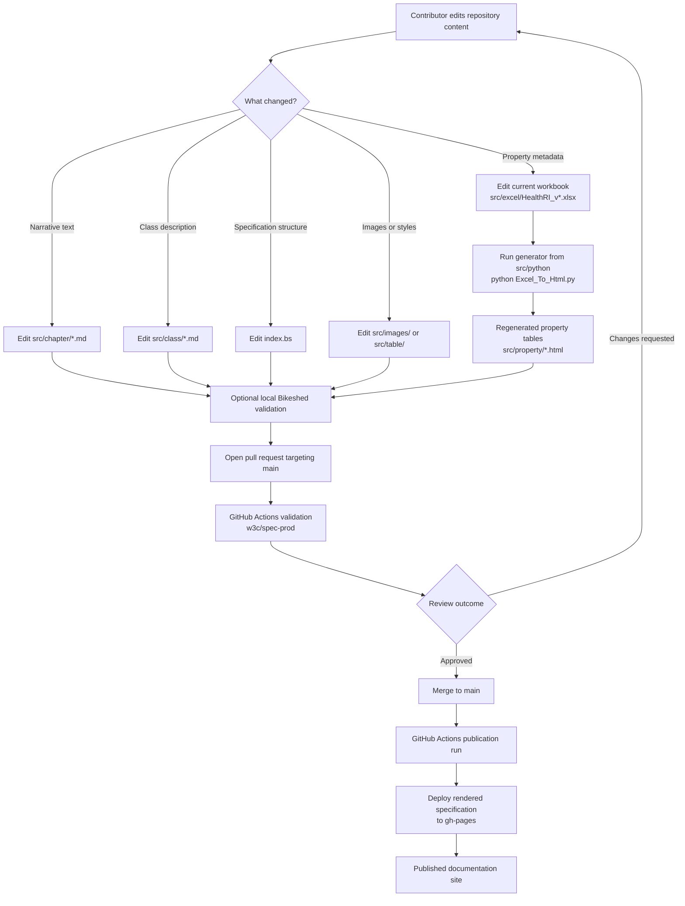

# Health-RI Metadata Documentation

This repository contains the source files, generated documentation fragments, and publication workflow for the **Health-RI Metadata Model documentation**.

The published documentation describes the Health-RI Core Metadata Schema for the **National Health Data Catalogue**.

| Resource                 | Link                                                                                              |
| ------------------------ | ------------------------------------------------------------------------------------------------- |
| Published specification  | [health-ri.github.io/metadata-documentation](https://health-ri.github.io/metadata-documentation/) |
| Related model repository | [Health-RI/health-ri-metadata](https://github.com/Health-RI/health-ri-metadata)                   |
| Repository issue tracker | [metadata-documentation issues](https://github.com/Health-RI/metadata-documentation/issues)       |

---

## Purpose

This repository is used to maintain and publish the human-readable technical specification of the Health-RI Core Metadata Schema.

It contains:

* the main Bikeshed source file;
* manually maintained explanatory chapters;
* manually maintained class descriptions;
* an Excel workbook used as structured source material for generated property tables;
* a JSON configuration file for controlled vocabulary mappings, requirement lookups, and property links;
* a Python script that converts Excel content into HTML table fragments;
* generated property-table fragments included by Bikeshed;
* GitHub Actions configuration for publication to GitHub Pages.

This repository is primarily intended for documentation maintainers, metadata model maintainers, and technical contributors working on the specification website.

It is **not** the main repository for all Health-RI metadata model artifacts. Model-level artifacts, SHACL shapes, releases, and model issue tracking are maintained in the related [`health-ri-metadata`](https://github.com/Health-RI/health-ri-metadata) repository.

---

## Repository relationship

The Health-RI metadata ecosystem uses multiple repositories and publication targets.

| Location                                                                                  | Main role                            | Main artifacts                                                                                                       |
| ----------------------------------------------------------------------------------------- | ------------------------------------ | -------------------------------------------------------------------------------------------------------------------- |
| [`Health-RI/metadata-documentation`](https://github.com/Health-RI/metadata-documentation) | Documentation-publication repository | Bikeshed source, Markdown chapters, class descriptions, generated property tables, GitHub Pages publication workflow |
| [`Health-RI/health-ri-metadata`](https://github.com/Health-RI/health-ri-metadata)         | Main model/schema repository         | Core metadata schema artifacts, SHACL shapes, releases, model-level issues, contribution process                     |
| [GitHub Pages site](https://health-ri.github.io/metadata-documentation/)                  | Published documentation output       | Rendered HTML specification                                                                                          |
| [Zenodo DOI record](https://doi.org/10.5281/zenodo.15395604)                              | Citable archival record              | DOI-linked project/release record                                                                                    |

In short:

* use this repository to edit, build, and publish the technical specification website;
* use [`health-ri-metadata`](https://github.com/Health-RI/health-ri-metadata) for model-level artifacts such as SHACL shapes, releases, and model issue tracking;
* use the [published specification](https://health-ri.github.io/metadata-documentation/) to read the rendered documentation.

---

## Key artifacts and source-of-truth rules

Different parts of the specification have different source files.

| Content type                                                               | Primary source                                                   | Generated? | Notes                                                                                                                                      |
| -------------------------------------------------------------------------- | ---------------------------------------------------------------- | ---------: | ------------------------------------------------------------------------------------------------------------------------------------------ |
| Specification structure and section order                                  | [`index.bs`](index.bs)                                           |         No | Controls document metadata, included files, section order, and Bikeshed configuration.                                                     |
| Explanatory chapters                                                       | `src/chapter/*.md`                                               |         No | Manually maintained narrative documentation.                                                                                               |
| Class descriptions                                                         | `src/class/*.md`                                                 |         No | Manually maintained class-level descriptions.                                                                                              |
| Property labels, definitions, URIs, ranges, cardinalities, and usage notes | Current versioned workbook in `src/excel/`                       |     Partly | The current workbook is `src/excel/HealthRI_v2.0.2.xlsx`; update the filename and generator configuration when the schema version changes. |
| Property table fragments                                                   | `src/property/*.html`                                            |        Yes | Generated from the Excel workbook and included by Bikeshed.                                                                                |
| Table styling fragments                                                    | `src/table/*.md`                                                 |         No | Manually maintained with care.                                                                                                             |
| Images and diagrams                                                        | `src/images/`                                                    |         No | Manually maintained visual assets.                                                                                                         |
| Publication workflow                                                       | [`.github/workflows/publish.yml`](.github/workflows/publish.yml) |         No | Builds, validates, and publishes the documentation through GitHub Actions.                                                                 |
| Published HTML site                                                        | `gh-pages` branch                                                |        Yes | Produced by the GitHub Actions publication workflow.                                                                                       |
| Rendered HTML output                                                       | `index.html`                                                     |        Yes | Generated by Bikeshed; do not edit manually.                                                                                               |

### Maintenance rules

* Edit the upstream source, not the generated output.
* Do not manually edit `index.html`.
* Do not manually edit generated `src/property/*.html` files unless there is a deliberate and documented exception.
* The Excel workbook is the source for generated property documentation, not for the entire specification.
* `index.bs` assembles both generated and manually maintained content.
* Production publication is handled through GitHub Actions, not by manually editing the rendered HTML.
* Versioned filenames in `src/excel/` should be reviewed whenever the metadata schema version changes.

---

## Build and publication pipeline

The documentation workflow has two related but distinct parts:

1. **Property-table generation**, needed when the Excel workbook changes.
2. **Specification rendering and publication**, handled by Bikeshed and GitHub Actions.



The GitHub Actions workflow in [`.github/workflows/publish.yml`](.github/workflows/publish.yml) uses `w3c/spec-prod` and targets the `gh-pages` branch.

The workflow is triggered by:

* pull requests targeting `main`;
* pushes to `main`.

Pull requests should be treated as validation opportunities. Publication should be expected after changes are merged or pushed to `main`, according to the repository’s GitHub Actions and GitHub Pages configuration.

Local builds are useful for validation before opening or merging a pull request, but production publication should be treated as CI/CD-managed.

---

## Key paths

| Path                                                             | Purpose                                                                          |
| ---------------------------------------------------------------- | -------------------------------------------------------------------------------- |
| [`.github/workflows/publish.yml`](.github/workflows/publish.yml) | GitHub Actions workflow for Bikeshed validation and GitHub Pages publication     |
| [`README.md`](README.md)                                         | Repository overview and maintenance guidance                                     |
| [`index.bs`](index.bs)                                           | Main Bikeshed source file                                                        |
| `index.html`                                                     | Rendered specification output; generated by Bikeshed; do not edit manually       |
| `src/chapter/`                                                   | Narrative specification chapters                                                 |
| `src/class/`                                                     | Class-level descriptions                                                         |
| `src/excel/`                                                     | Versioned Excel workbook used as structured source for generated property tables |
| `src/python/`                                                    | Generator scripts, including `Excel_To_Html.py`                                  |
| `src/property/`                                                  | Generated property-table fragments                                               |
| `src/table/`                                                     | Table-style fragments                                                            |
| `src/images/`                                                    | Logos, diagrams, and visual assets                                               |

---

## Editing guidance

Use the following guide when deciding where to make a change.

| Change type                                                                | Edit                                                             |
| -------------------------------------------------------------------------- | ---------------------------------------------------------------- |
| Document metadata, editor list, abstract, section order, or included files | [`index.bs`](index.bs)                                           |
| Narrative explanation, scope, introduction, or controlled vocabulary text  | `src/chapter/*.md`                                               |
| Class definition or class usage note                                       | `src/class/*.md`                                                 |
| Property label, URI, definition, range, cardinality, or usage note         | Current versioned workbook in `src/excel/`                       |
| Generated property table                                                   | Regenerate `src/property/*.html` from the Excel workbook         |
| Diagrams, logos, or images                                                 | `src/images/`                                                    |
| GitHub Pages build/deployment behavior                                     | [`.github/workflows/publish.yml`](.github/workflows/publish.yml) |

Small textual edits can be made directly in GitHub when they do not require regenerating files. Changes to the Excel workbook should be followed by regenerating the property-table fragments.

The documentation distinguishes between **main classes** and **supportive classes**. Main and supportive class documentation is assembled from files in `src/chapter/`, `src/class/`, and `src/property/`.

Controlled vocabulary guidance is maintained in [`src/chapter/10-controlled-vocabularies.md`](src/chapter/10-controlled-vocabularies.md).

When changing controlled-vocabulary requirements, check whether updates are also needed in:

* the Excel workbook;
* generated property tables;
* SHACL shapes in [`health-ri-metadata`](https://github.com/Health-RI/health-ri-metadata);
* examples or implementation guidance.

---

## Regenerating property tables

Only regenerate property-table fragments when the Excel workbook changes.

The current generator is [`src/python/Excel_To_Html.py`](src/python/Excel_To_Html.py).

The script uses relative paths to read from `../excel/` and write to `../property/`. Therefore, run it from `src/python/`:

```bash
cd src/python
python Excel_To_Html.py
cd ../..
```

Expected output:

```text
src/property/*.html
```

Review the generated diff carefully before committing.


---

## Local Bikeshed validation

The production publication workflow is automated through GitHub Actions. Local validation is still useful before opening or merging substantial pull requests.

Install Bikeshed using the [official Bikeshed installation instructions](https://speced.github.io/bikeshed/#install-final).

A common installation route is:

```bash
pipx install bikeshed
bikeshed update
```

From the repository root, build the specification locally:

```bash
bikeshed spec index.bs index.html
```

Or validate without writing output:

```bash
bikeshed --dry-run spec index.bs
```

Resolve Bikeshed errors and relevant warnings before submitting changes.

Do not manually edit the generated `index.html`.

---

## Publication

The rendered specification is published at: <https://health-ri.github.io/metadata-documentation/>

Publication is handled by the GitHub Actions workflow in [`.github/workflows/publish.yml`](.github/workflows/publish.yml).

If changes do not appear on the published site, check:

* the GitHub Actions run;
* the `gh-pages` branch;
* whether the change was merged or pushed to `main`;
* whether the relevant source or generated files were committed;
* browser or CDN caching.

---

## Alignment with `health-ri-metadata` and SHACL

This repository provides the human-readable documentation. Model-level artifacts and SHACL shapes are maintained in [`Health-RI/health-ri-metadata`](https://github.com/Health-RI/health-ri-metadata).

When changing the specification, check whether corresponding SHACL shapes or model artifacts also need to be updated.

Changes that may require SHACL updates include:

* changed cardinality;
* changed expected datatype;
* changed node kind;
* changed required property;
* changed target class;
* added or removed property;
* changed controlled-vocabulary requirement;
* changed class/property relationship.

The documentation and validation artifacts should remain aligned.

---

## Issues and support

Use the appropriate channel for the type of issue.

| Issue type                                                                                                       | Where to report                                                                             |
| ---------------------------------------------------------------------------------------------------------------- | ------------------------------------------------------------------------------------------- |
| Documentation typo, broken internal link, layout issue, or wording improvement                                   | [metadata-documentation issues](https://github.com/Health-RI/metadata-documentation/issues) |
| Model issue, missing property, incorrect cardinality, datatype issue, SHACL issue, or structural metadata change | [health-ri-metadata issues](https://github.com/Health-RI/health-ri-metadata/issues)         |
| Onboarding or catalogue-process question                                                                         | Health-RI onboarding/support channels                                                       |
| Sensitive issue or security-related concern                                                                      | Do not report publicly; contact Health-RI directly                                          |

Support contacts:

* [servicedesk@health-ri.nl](mailto:servicedesk@health-ri.nl)
* [onboarding@health-ri.nl](mailto:onboarding@health-ri.nl)

---

## Useful links

| Resource                           | Link                                                                                              |
| ---------------------------------- | ------------------------------------------------------------------------------------------------- |
| Published specification            | [health-ri.github.io/metadata-documentation](https://health-ri.github.io/metadata-documentation/) |
| Main metadata repository           | [Health-RI/health-ri-metadata](https://github.com/Health-RI/health-ri-metadata)                   |
| Documentation repository           | [Health-RI/metadata-documentation](https://github.com/Health-RI/metadata-documentation)           |
| Health-RI Core Metadata Schema DOI | [10.5281/zenodo.15395604](https://doi.org/10.5281/zenodo.15395604)                                |
| Bikeshed documentation             | [speced.github.io/bikeshed](https://speced.github.io/bikeshed/)                                   |
| DCAT 3                             | [W3C Data Catalog Vocabulary 3](https://www.w3.org/TR/vocab-dcat-3/)                              |
| DCAT-AP NL                         | [DCAT-AP NL 3.0](https://docs.geostandaarden.nl/dcat/dcat-ap-nl30/)                               |
| HealthDCAT-AP                      | [HealthDCAT-AP documentation](https://healthdataeu.pages.code.europa.eu/healthdcat-ap/)           |
